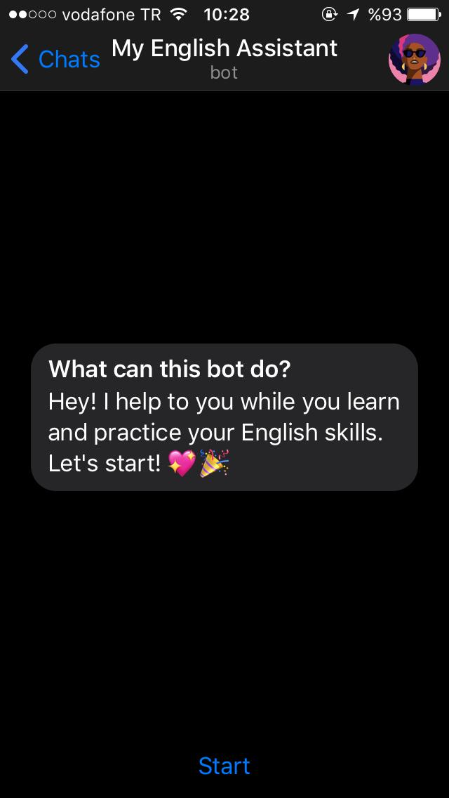
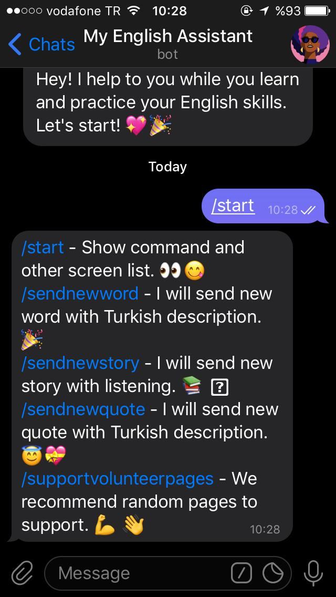
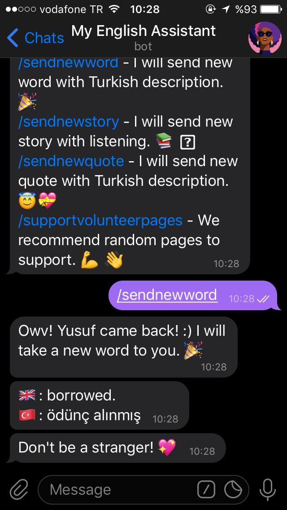
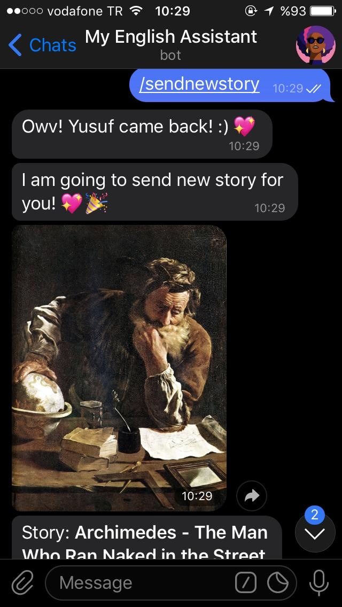
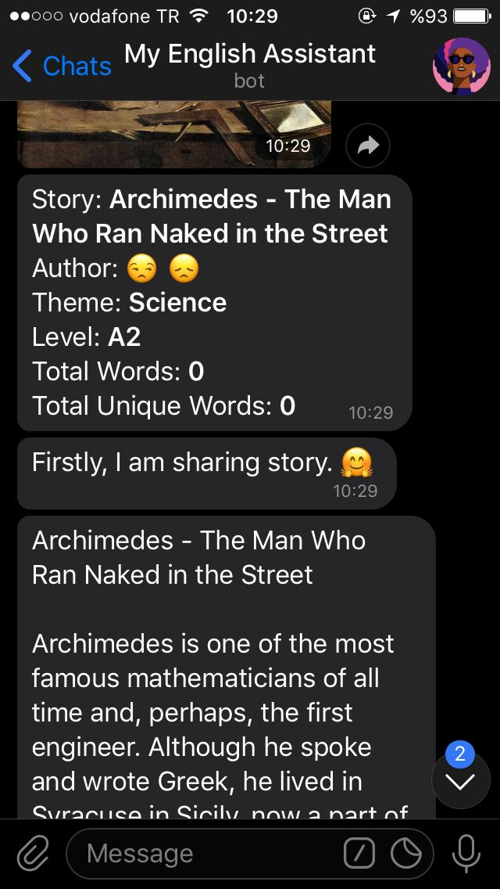
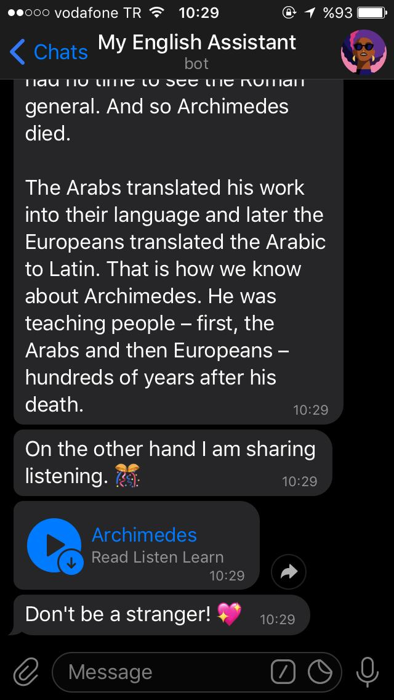
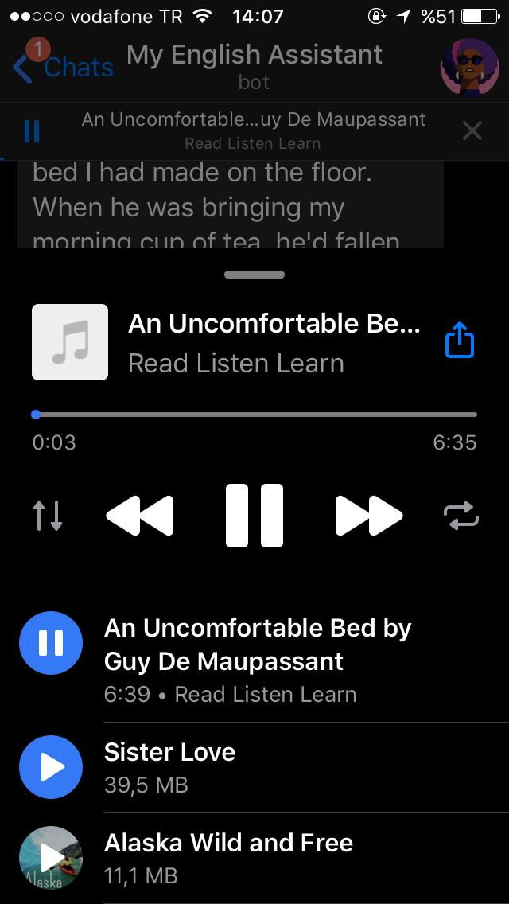

# Welcome to My English Assitant Bot👋
<p align="center">

</p>
This bot provides to you learn english vocabularies, quotes or reading short story and listening pronunciation with Telegram channel.

---


## Usage and Install

Use live here: [Telegram: @myenglishassistantbot](https://t.me/myenglishassistantbot)

Firstly, you sould change `Telegram Bot Token` and `MySQL` connection string for usages.

They define in `appsettings.json` file. It under `Configuration` folder.

```json
{
  "MySQLConnectionString": "Server=; Database=; Uid=; Pwd=;",
  "TelegramBotKey": "TelegramBotKey"
}
```

---

`git clone https://github.com/yusufyilmazfr/english-assistant-telegram-bot.git`

`cd src\EnglishAssistantTelegramBot.Console`

`dotnet run`


---


## Screnshoots

As you can see it seet! 💝🎉








